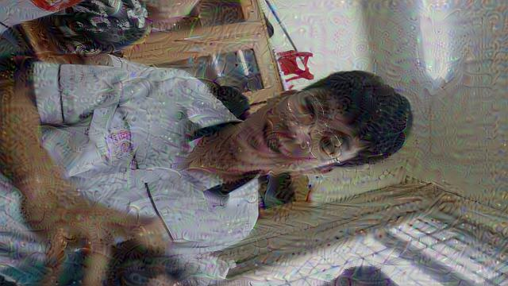
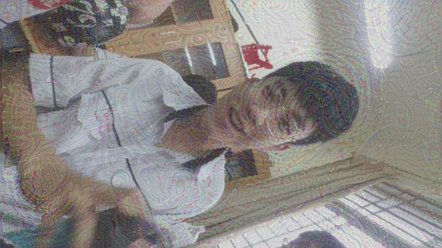
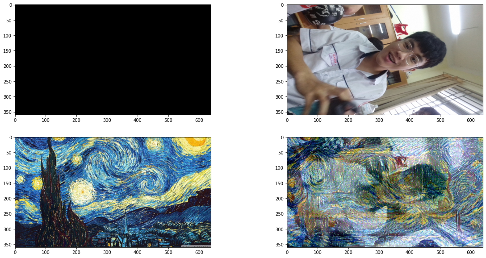
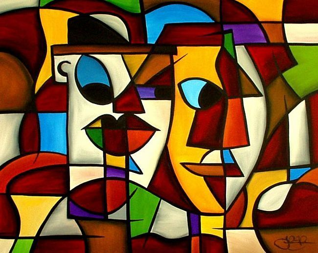
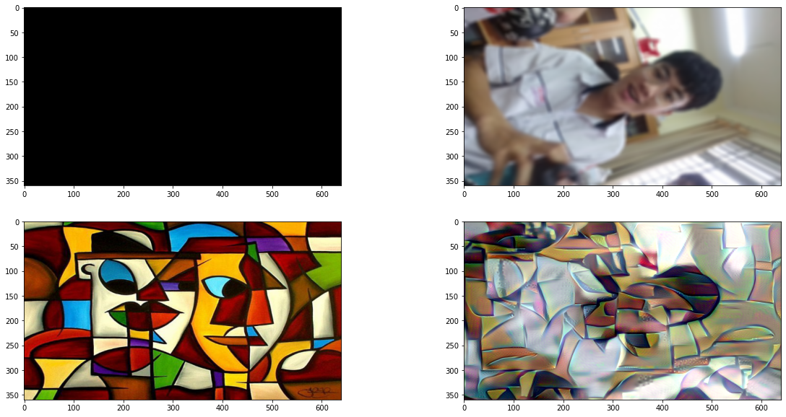

# Style_transfer
implementation for the presentation of Justin about style transfer in CS231n course
# Original image

## Vangogh original painting

## Some failures in Vangogh starry night style

## Maybe a success?

## Style no.2: "cubic"

## A good image ?
By bluring the original image, sharp edges are removed for a more artistic image

